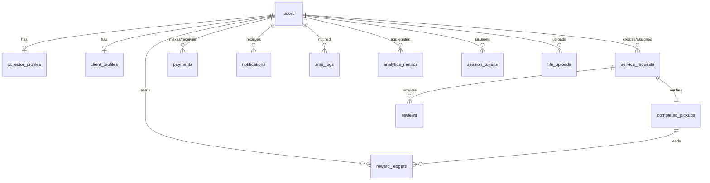

```markdown
# 1. Database Overview
- **DBMS**: MySQL 8.x  
- **Architecture**: Fully normalized transactional schema optimized for MVC PHP app with role-based access. Includes auditing fields, geo data, analytics. UTF8MB4 charset.
- **Key Traits**: Strict FK constraints, cascading actions, partitioned analytics tables, prepared statements, environment-based configs.

# 2. Schema Design

## users
- **Purpose**: Core auth + identity.  
- **Fields**:
  - `user_id` INT PK AI
  - `uuid` CHAR(36) UNIQUE default UUID()
  - `role` ENUM('collector','client','admin') NOT NULL
  - `email` VARCHAR(190) UNIQUE NOT NULL
  - `phone` VARCHAR(20) UNIQUE NOT NULL
  - `password_hash` VARCHAR(255) NOT NULL
  - `status` ENUM('pending','active','suspended') DEFAULT 'pending'
  - `last_login_at` DATETIME NULL
  - `created_at` DATETIME DEFAULT CURRENT_TIMESTAMP
  - `updated_at` DATETIME DEFAULT CURRENT_TIMESTAMP ON UPDATE CURRENT_TIMESTAMP
- **Indexes**: PK, UNIQUE(email), UNIQUE(phone), INDEX(role,status)
- **Relationships**: 1:1 to `collector_profiles`, `client_profiles`, 1:N with requests/payments.

## collector_profiles
- **Purpose**: Collector extended profile & geo metadata.  
- **Fields**:
  - `collector_id` INT PK FK -> users.user_id ON DELETE CASCADE
  - `display_name` VARCHAR(120)
  - `bio` TEXT
  - `latitude` DECIMAL(10,7)
  - `longitude` DECIMAL(10,7)
  - `service_radius_km` DECIMAL(5,2) DEFAULT 5.00
  - `waste_types` JSON (array of strings)
  - `availability_status` ENUM('available','busy','offline') DEFAULT 'offline'
  - `verification_level` ENUM('unverified','pending','verified')
  - `profile_image` VARCHAR(255)
  - `id_document_path` VARCHAR(255)
  - `rating_avg` DECIMAL(3,2) DEFAULT 0
  - `rating_count` INT DEFAULT 0
  - `created_at`, `updated_at`
- **Indexes**: PK, SPATIAL INDEX(lat,long) or composite `(latitude, longitude)`, INDEX(availability_status)
- **Relationships**: 1:N service_requests, completed_pickups, ratings.

## client_profiles
- `client_id` INT PK FK -> users.user_id
- `organization_name` VARCHAR(150)
- `address_line` VARCHAR(255)
- `city` VARCHAR(120)
- `latitude` DECIMAL(10,7)
- `longitude` DECIMAL(10,7)
- `preferred_waste_types` JSON
- `created_at`, `updated_at`
- **Indexes**: PK, geolocation composite.
- **Relationships**: 1:N service_requests, payments, reviews.

## service_requests
- Purpose: pickup requests  
- Fields:
  - `request_id` BIGINT PK AI
  - `client_id` INT FK -> users.user_id
  - `collector_id` INT FK -> users.user_id NULL (assigned)
  - `requested_waste_types` JSON
  - `description` TEXT
  - `pickup_address` VARCHAR(255)
  - `latitude` DECIMAL(10,7)
  - `longitude` DECIMAL(10,7)
  - `desired_pickup_time` DATETIME
  - `status` ENUM('pending','accepted','in_progress','completed','cancelled')
  - `client_confirmed_at` DATETIME NULL
  - `collector_confirmed_at` DATETIME NULL
  - `payment_status` ENUM('unpaid','pending','paid','refunded')
  - `created_at`, `updated_at`
- **Indexes**: INDEX(client_id,status), INDEX(collector_id,status), composite geolocation.
- **Relationships**: FK to users, 1:1 to completed_pickups, payments.

## completed_pickups
- Fields:
  - `pickup_id` BIGINT PK AI
  - `request_id` BIGINT UNIQUE FK -> service_requests.request_id ON DELETE CASCADE
  - `collector_id` INT FK -> users.user_id
  - `client_id` INT FK -> users.user_id
  - `verified_weight_kg` DECIMAL(8,2)
  - `waste_category_breakdown` JSON
  - `collector_verification_photo` VARCHAR(255)
  - `client_verification_photo` VARCHAR(255)
  - `collector_confirmed_at` DATETIME
  - `client_confirmed_at` DATETIME
  - `verification_status` ENUM('pending','verified','disputed')
  - `co2_offset_kg` DECIMAL(10,2)
  - `landfill_diverted_kg` DECIMAL(10,2)
  - `created_at`
- **Indexes**: UNIQUE(request_id), INDEX(collector_id), INDEX(client_id), INDEX(verification_status)
- **Relationships**: ties into rewards, analytics.

## payments
- Fields:
  - `payment_id` BIGINT PK AI
  - `request_id` BIGINT FK -> service_requests.request_id
  - `payer_id` INT FK -> users.user_id
  - `collector_id` INT FK -> users.user_id
  - `amount` DECIMAL(10,2)
  - `currency` CHAR(3) DEFAULT 'USD'
  - `payment_method` ENUM('cash','card','wallet','mobile_money')
  - `transaction_ref` VARCHAR(100) UNIQUE
  - `status` ENUM('initiated','successful','failed','refunded')
  - `processed_at` DATETIME
  - `created_at`
- **Indexes**: INDEX(request_id), INDEX(payer_id), INDEX(status, processed_at)

## notifications
- Fields:
  - `notification_id` BIGINT PK AI
  - `user_id` INT FK -> users.user_id
  - `type` ENUM('request','confirmation','payment','reward','system')
  - `title`, `message`
  - `is_read` TINYINT(1) DEFAULT 0
  - `metadata` JSON
  - `created_at`
- **Indexes**: user_id, is_read

## sms_logs
- Fields:
  - `sms_id` BIGINT PK AI
  - `user_id` INT FK
  - `phone` VARCHAR(20)
  - `message` TEXT
  - `status` ENUM('queued','sent','failed')
  - `provider_response` TEXT
  - `created_at`
- **Indexes**: user_id, status

## reviews
- Fields:
  - `review_id` BIGINT PK AI
  - `request_id` BIGINT FK -> service_requests.request_id
  - `client_id` INT FK
  - `collector_id` INT FK
  - `rating` TINYINT CHECK 1-5
  - `comment` TEXT
  - `created_at`
- **Indexes**: collector_id, client_id, rating

## reward_ledgers
- Fields:
  - `reward_id` BIGINT PK AI
  - `collector_id` INT FK
  - `period_month` CHAR(7) (YYYY-MM)
  - `verified_pickups` INT
  - `bonus_amount` DECIMAL(10,2)
  - `status` ENUM('pending','approved','paid')
  - `calculated_at`, `paid_at`
  - UNIQUE(collector_id, period_month)
- **Indexes**: collector_id, status

## analytics_metrics
- Purpose: aggregated stats for dashboard
- Fields:
  - `metric_id` BIGINT PK AI
  - `metric_date` DATE
  - `collector_id` INT NULL FK
  - `city` VARCHAR(120) NULL
  - `metric_type` ENUM('waste_volume','co2_offset','requests','completed','revenue')
  - `value` DECIMAL(18,4)
  - `created_at`
- **Indexes**: metric_date, metric_type, collector_id

## audit_logs
- Fields:
  - `audit_id` BIGINT PK
  - `user_id` INT FK NULL
  - `action` VARCHAR(120)
  - `entity` VARCHAR(120)
  - `entity_id` VARCHAR(50)
  - `request_ip` VARBINARY(16)
  - `user_agent` VARCHAR(255)
  - `created_at`
- **Indexes**: user_id, entity, action

## session_tokens
- Fields:
  - `session_id` CHAR(64) PK
  - `user_id` INT FK
  - `csrf_token` CHAR(64)
  - `expires_at` DATETIME
  - `ip_address` VARBINARY(16)
  - `user_agent` VARCHAR(255)
  - `created_at`
- **Indexes**: user_id, expires_at

## file_uploads
- Fields:
  - `file_id` BIGINT PK
  - `user_id` INT FK
  - `entity` VARCHAR(100)
  - `entity_id` BIGINT
  - `file_path` VARCHAR(255)
  - `mime_type` VARCHAR(120)
  - `size_kb` INT
  - `status` ENUM('active','archived','deleted')
  - `created_at`
- **Indexes**: user_id, entity/entity_id

# 3. Entity Relationship Diagram (Mermaid)



# 4. Data Integrity
- Use FK constraints with cascade delete for dependent records (profiles, notifications). 
- ENUMs enforce valid statuses.
- CHECK constraints (MySQL 8) for rating, weight ≥0.
- Unique constraints on email/phone/uuid/transaction references.
- Trigger or stored procedure to update collector rating averages after reviews.
- Dual confirmation logic requires both timestamps before marking `verification_status = verified`.
- Payment + request statuses synchronized through transactions.

# 5. Indexes & Performance
- Geospatial searches: composite `(latitude, longitude)` with bounding box queries; optionally use MySQL spatial indexes (POINT type) for high-precision search.
- Frequent filters: `service_requests(status, desired_pickup_time)`, `completed_pickups(collector_id, verification_status)`, `payments(status, processed_at)`.
- Covering indexes for analytics: `(metric_date, metric_type)` and `(collector_id, metric_date)`.
- Partition `analytics_metrics` by range on `metric_date` for large data volume.
- Use BTREE indexes for `notifications(user_id, is_read)` to paginate.
- Add full-text index on `collector_profiles.bio` and `service_requests.description` for search.

# 6. Sample Queries

**1. Nearby available collectors (5km radius)**
```sql
SELECT u.user_id, cp.display_name, cp.waste_types,
       ST_Distance_Sphere(
         POINT(cp.longitude, cp.latitude),
         POINT(:lng, :lat)
       )/1000 AS distance_km
FROM collector_profiles cp
JOIN users u ON u.user_id = cp.collector_id
WHERE u.status = 'active'
  AND cp.availability_status = 'available'
  AND ST_Distance_Sphere(POINT(cp.longitude, cp.latitude),
                         POINT(:lng, :lat)) <= cp.service_radius_km * 1000
ORDER BY distance_km
LIMIT 20;
```

**2. Create service request**
```sql
INSERT INTO service_requests
(client_id, requested_waste_types, description, pickup_address,
 latitude, longitude, desired_pickup_time, status, created_at)
VALUES (:client_id, :waste_json, :desc, :address,
        :lat, :lng, :pickup_time, 'pending', NOW());
```

**3. Dual confirmation update**
```sql
UPDATE completed_pickups
SET collector_confirmed_at = IFNULL(collector_confirmed_at, NOW()),
    verification_status = CASE
        WHEN client_confirmed_at IS NOT NULL THEN 'verified'
        ELSE verification_status
    END
WHERE pickup_id = :pickup_id AND collector_id = :collector_id;
```

**4. Monthly reward calculation**
```sql
INSERT INTO reward_ledgers(collector_id, period_month, verified_pickups, bonus_amount, status, calculated_at)
SELECT cp.collector_id,
       DATE_FORMAT(NOW(), '%Y-%m') AS period_month,
       COUNT(*) AS verified_pickups,
       COUNT(*) * :bonus_per_pickup AS bonus_amount,
       'pending', NOW()
FROM completed_pickups cp
WHERE cp.verification_status = 'verified'
  AND DATE_FORMAT(cp.created_at, '%Y-%m') = DATE_FORMAT(NOW(), '%Y-%m')
GROUP BY cp.collector_id
ON DUPLICATE KEY UPDATE
    verified_pickups = VALUES(verified_pickups),
    bonus_amount = VALUES(bonus_amount),
    calculated_at = NOW();
```

**5. Analytics summary for dashboard**
```sql
SELECT DATE(metric_date) AS day,
       SUM(CASE WHEN metric_type='waste_volume' THEN value END) AS waste_volume,
       SUM(CASE WHEN metric_type='co2_offset' THEN value END) AS co2_offset
FROM analytics_metrics
WHERE metric_date BETWEEN :start AND :end
GROUP BY day
ORDER BY day;
```

# 7. Migration Strategy
1. **Version Control**: Use migrations via Phinx/Laravel-style tool; each SQL file includes `up` and `down`.
2. **Environment Config**: `.env` for DB credentials, loaded into migration tool.
3. **Initial Setup**:
   - `CREATE DATABASE waste2worth CHARACTER SET utf8mb4 COLLATE utf8mb4_unicode_ci;`
   - Run baseline migration to create tables in dependency order: users → profiles → service_requests → etc.
4. **Seed Data**: Insert default admin, waste types, config values via seed scripts.
5. **Schema Changes**: Use semantic versioning (e.g., `2024_07_01_001_add_reward_ledgers`). Ensure backwards-compatible changes; add new columns nullable, backfill, then enforce NOT NULL.
6. **Testing**: Use staging DB mirror, run migrations, rollback tests.
7. **Backup & Monitoring**: Regular logical backups (mysqldump or Percona XtraBackup); monitor schema changes with checksum. 
8. **Deployment**: CI/CD pipeline runs migrations before application deploy; wrap migrations in transactions where possible.

```
