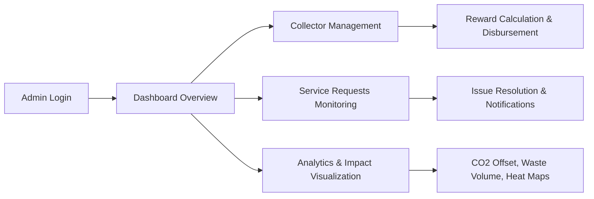

# Waste2Worth System Flow Documentation

## 1. User Workflows

### 1.1 Collector Journey (Registration → Pickup Verification → Rewards)

```mermaid
flowchart LR
    A[Collector visits Portal] --> B[Create Account / Login]
    B -->|Registration| C[Submit Profile & Docs]
    B -->|Login| D[Dashboard - Availability]
    C --> D
    D --> E[Update Location & Availability]
    D --> F[Receive Pickup Request Notification]
    F --> G[Accept / Decline Request]
    G --> H[Pickup Execution]
    H --> I[Dual Verification (Collector + Client)]
    I --> J[Mark Complete & Upload Proof]
    J --> K[Rewards Engine Updates Metrics]
    K --> L[Monthly Bonus Summary]
```

**Key Activities**
- Secure registration with profile details, geo-location, waste types, service area.
- Availability management via dashboard.
- Receive request notifications and respond.
- Log pickups with photos, verification, and status updates.
- Track performance metrics and rewards.

### 1.2 Client Journey (Discovery → Request → Confirmation → Payment)

```mermaid
flowchart LR
    A[Client Portal Access] --> B[Login / Register]
    B --> C[Interactive Map Search]
    C --> D[Apply Filters (Waste type, rating, availability)]
    D --> E[Select Collector]
    E --> F[Request Pickup & Schedule]
    F --> G[Real-time Status Updates]
    G --> H[Pickup Completion Notification]
    H --> I[Confirm Service & Rate Collector]
    H --> J[Make Payment]
    J --> K[Transaction Logged & Receipt]
```

**Key Activities**
- Account creation with geolocation consent.
- Map-based discovery with AJAX filtering.
- Request pickups, monitor status, communicate with collector.
- Confirm completion with optional verification photo.
- Make payments and review history.

### 1.3 Admin/Municipal Journey (Monitoring → Analytics → Rewards)



**Key Activities**
- Role-based access to manage collectors, requests, payments.
- Monitor system health, KPIs, and compliance.
- Configure rewards, view performance.
- Run analytics dashboards with Chart.js, geographical maps.
- Export reports, trigger SMS notices, manage municipalities’ data.

---

## 2. Data Flows

### 2.1 High-Level Data Movement

```mermaid
graph TD
    U[Users] -->|Forms, AJAX| W[PHP Controllers]
    W --> S[Service Layer]
    S --> DB[(MySQL)]
    S --> EX[External APIs (SMS, Maps)]
    DB --> S
    S --> W
    W -->|Responses (HTML/JSON)| U
    EX --> S
```

**Flow Explanation**
1. **Frontend Interaction**: Users interact via responsive UI; inputs validated via JavaScript.
2. **Controllers (MVC)**: Requests routed to controllers, invoking service methods.
3. **Service Layer**: Applies business logic (matching, rewards, verification).
4. **Data Access**: Repository classes use prepared statements for SQL operations.
5. **External Integrations**: Service layer triggers SMS (Twilio), map APIs, Chart.js data feed.
6. **Responses**: Controllers return HTML views or JSON for AJAX.

### 2.2 Key Data Interactions
- `users` ↔ `collector_profiles`: join for portal roles; profile updates require both tables.
- `service_requests` ↔ `completed_pickups`: lifecycle tracking; verification triggers analytics.
- `payments` ↔ `transaction_logs`: ensures audit trail.
- `analytics_metrics` aggregates from `completed_pickups`, `payments`, geographic clustering.

---

## 3. Integration Points

| Component | Interface | Purpose | Notes |
|-----------|-----------|---------|-------|
| Leaflet.js / Google Maps API | JavaScript SDK | Display map, geocode addresses, proximity search | API keys stored in env config |
| Twilio (or SMS provider) | REST API via cURL | Send SMS notifications for low-tech users | Service layer wrapper for reuse and retry |
| Chart.js | Frontend JS | Render analytics charts | Data delivered via AJAX endpoints |
| CSRF Protection | PHP token middleware | Validate form requests | Token stored in session and embedded in forms |
| Session & Auth | PHP sessions | Role-based access, login state | Regenerate session IDs post-login |
| File Upload Handling | PHP file system | Profile images, verification photos | Sanitized filenames, size/type validation |
| Payment Module | Custom PHP | Capture payments, store logs | Ready for future gateway integration |

---

## 4. Error Handling

### 4.1 General Principles
- **Input Validation**: Client-side (JS) and server-side (PHP filter, custom validators).
- **SQL Protection**: Prepared statements, parameter binding, strict schema constraints.
- **Exception Management**: Try/catch in service layer; bubble up meaningful error messages.
- **Logging**: Centralized logger (e.g., Monolog or custom) writing to file; critical alerts flagged.
- **Graceful Degradation**: If external API fails (SMS/map), system notifies user and retries/queues.

### 4.2 Specific Scenarios
| Scenario | Handling Strategy |
|----------|------------------|
| Authentication failure | Increment login attempt counter, show generic error, log IP |
| CSRF token mismatch | Invalidate session, prompt re-login, log security event |
| File upload error | Validate before save, return specific message (size/type), delete partial uploads |
| DB transaction failure | Wrap operations in transactions; rollback on failure, log details |
| SMS API downtime | Queue message for retry, notify admin, display fallback notification |
| Map API key invalid | Display fallback list view, alert admin via log/email |
| Payment errors | Record failed state, notify client, prevent duplicate charges |

### 4.3 User Feedback
- Inline form errors with clear language.
- Dashboard notifications for system issues (e.g., “Map service temporarily unavailable”).
- Email/SMS for critical account actions (verification, password reset).

---

**This documentation provides a clear blueprint for development, ensuring consistent user experiences, reliable data flows, and robust integration/error-handling strategies across the Waste2Worth platform.**
